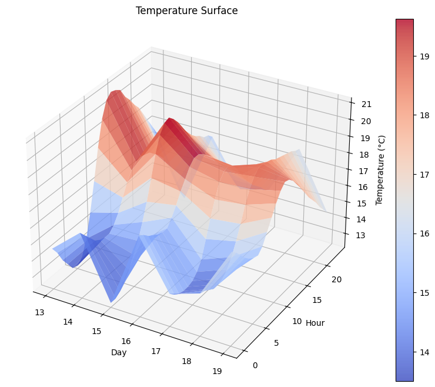
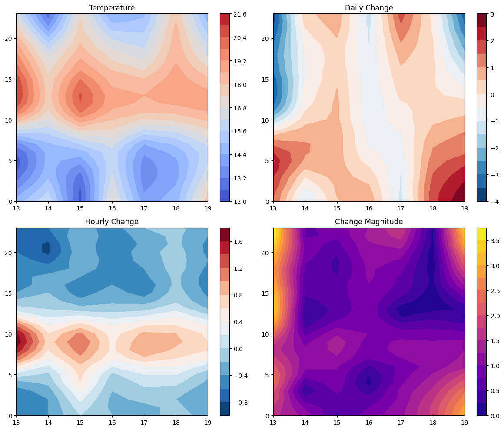

# Weather Data Visualisation

A Python script that fetches weather forecast data from the Open-Meteo API and creates various visualizations including 2D line plots, 3D surface plots, and gradient analysis.

## Features

- Fetches hourly temperature forecast data from Open-Meteo API
- Creates multiple types of visualizations:
  - 2D line plot of temperature over time
  - 3D line plot with day/hour/temperature coordinates
  - 3D surface plot showing temperature patterns
  - Gradient analysis with contour plots
  - 3D surface with gradient vectors

## Requirements

```bash
pip install requests numpy pandas matplotlib seaborn
```

## Usage

### Basic Usage

```python
from weather_visualization import WeatherVisualizer

# Initialize with default location (Berlin)
weather_viz = WeatherVisualizer()

# Fetch data and generate all plots
if weather_viz.fetch_data():
    weather_viz.generate_all_plots()
```

### Custom Location

```python
# Initialize with custom coordinates (e.g., New York City)
weather_viz = WeatherVisualizer(latitude=40.7128, longitude=-74.0060)

# Fetch data
weather_viz.fetch_data()

# Generate specific plots
weather_viz.plot_temperature_line()
weather_viz.plot_3d_surface()
weather_viz.analyze_gradients()
```

### Individual Plot Methods

- `plot_temperature_line()` - 2D line plot of temperature over time
- `plot_3d_line()` - 3D line plot with scatter points
- `plot_3d_surface()` - 3D surface plot
- `analyze_gradients()` - Gradient analysis with statistics and plots
- `plot_3d_with_vectors()` - 3D surface with gradient vectors
- `generate_all_plots()` - Generate all visualization types

## Sample Output

Here's what the visualizations look like:


**Gradient Analysis:**




**3D Temperature Surface:**


## Notes

- Uses the free Open-Meteo API (no key needed)
- The gradient stuff was me trying to understand how temperature changes across time
- Probably went overboard with the 3D plots but they look cool

That's all son, watch your step kid.
